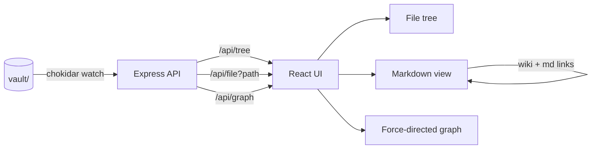
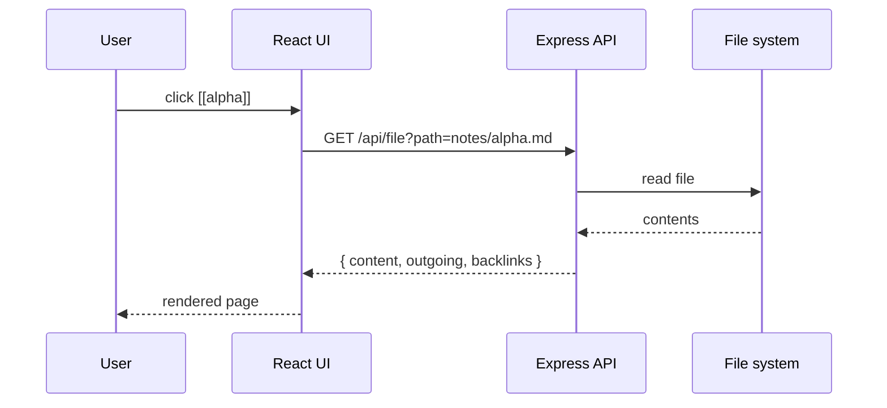

# Knowledge Graph

The project you're looking at right now. It renders [[index]] and the
notes in [[alpha]] and [[beta]].

## Goals

- Render markdown like Obsidian
- Track wiki-style and standard markdown links
- Surface backlinks for any open note
- Visualise the link graph

## Stack

- Express API + React UI, both TypeScript
- npm workspaces
- Tailwind v4 for styling
- `react-force-graph-2d` for the graph view

## Architecture

## Request lifecycle

